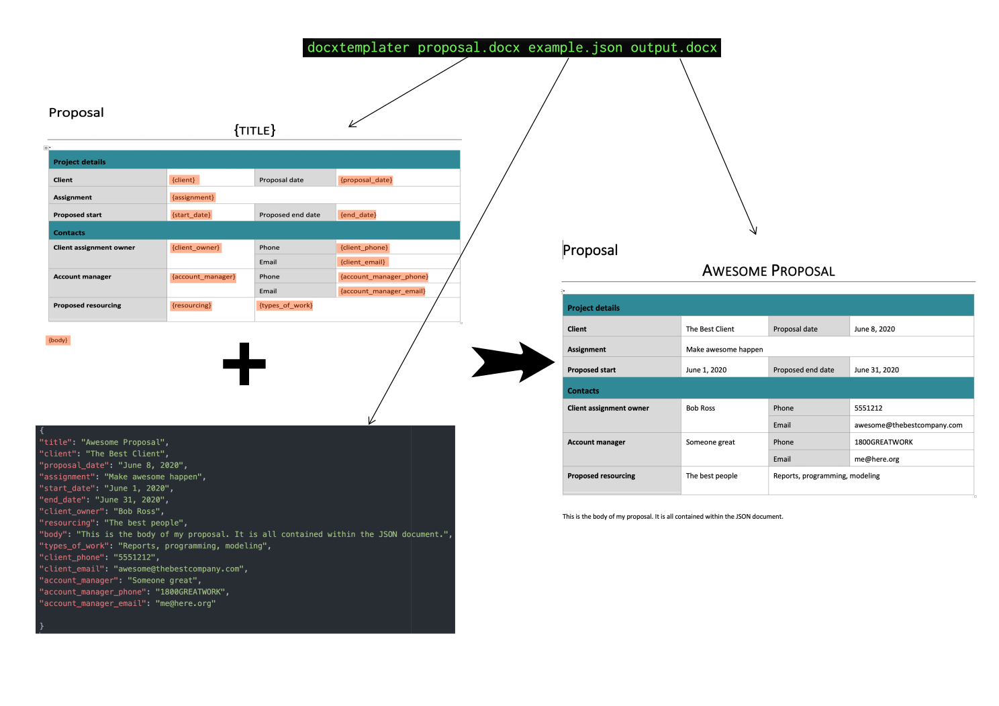

# Filling in Word Documents with JSON data

This uses the docxtemplater to do simple fillins inside of Word Documents. 



## Installation 

```
npm install -g docxtemplater-cli
```

Documentation: https://docxtemplater.readthedocs.io/en/latest/cli.html


